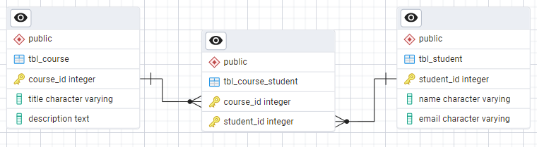

# Tarea 2 - William Saldarriaga

## Punto 1: Modelo ER Básico - Courses and Students

Se relaciona el modelo entidad-relación para gestionar información sobre cursos y estudiantes.

### Entidades

#### Course (Curso)
La entidad `Course` representa los cursos ofrecidos. 

- **Course_ID**: Identificador único para cada curso. Clave primaria.
- **Title**: Título del curso.
- **Description**: Descripción del curso.

#### Student (Estudiante)
La entidad `Student` representa a los estudiantes. 

- **Student_ID**: Identificador único para cada estudiante. Clave primaria.
- **Name**: Nombre del estudiante.
- **Email**: Dirección de correo electrónico del estudiante.

#### Course_Student (Curso_Estudiante)
Esta entidad de relación (pivote) gestiona la inscripción de los estudiantes en los cursos, representando la relación muchos a muchos entre `Course` y `Student`.

- **Course_ID**: Clave foránea a `Course`.
- **Student_ID**: Clave foránea a `Student`.

### Relaciones

- Un estudiante puede estar inscrito en uno o más cursos.
- Un curso puede tener uno o más estudiantes.

### Diagrama

---

## Punto 2: Modelo ER Complejo - Projects and Employees

Se relaciona el modelo entidad-relación para gestionar información sobre proyectos y empleados.

### Entidades

#### Project (Proyecto)
La entidad `Project` representa los proyectos.

- **Project_ID**: Identificador único para cada proyecto. Clave primaria.
- **Name**: Nombre del proyecto.
- **Start_Date**: Fecha de inicio del proyecto.
- **End_Date**: Fecha estimada de finalización del proyecto.

#### Employee (Empleado)
La entidad `Employee` representa a los empleados.

- **Employee_ID**: Identificador único para cada empleado.  Clave primaria.
- **Name**: Nombre completo del empleado.
- **Position**: Cargo o posición del empleado en la organización.
- **Department**: Departamento al que pertenece el empleado.

#### Project_Employee (Proyecto_Empleado)
Esta entidad de relación (tabla pivote) gestiona la asignación de empleados a proyectos, representando la relación muchos a muchos entre `Project` y `Employee`.

- **Project_ID**: Clave foránea de  `Project`.
- **Employee_ID**: Clave foránea de `Employee`.

### Relaciones

- Un empleado puede trabajar en uno o más proyectos.
- Un proyecto puede tener uno o más empleados.

### Diagrama

