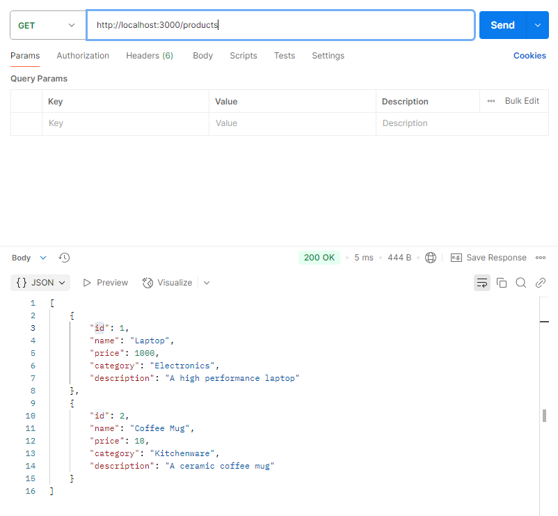
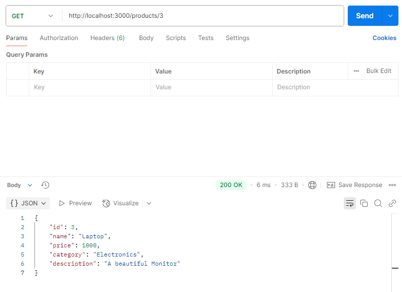
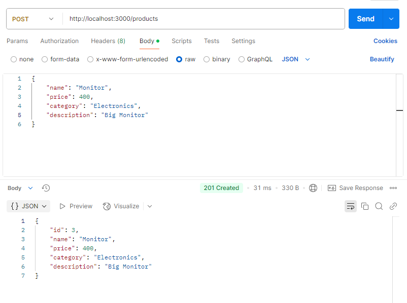
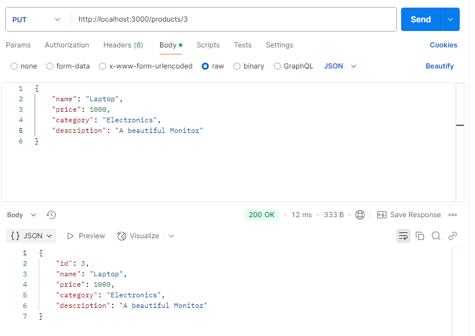
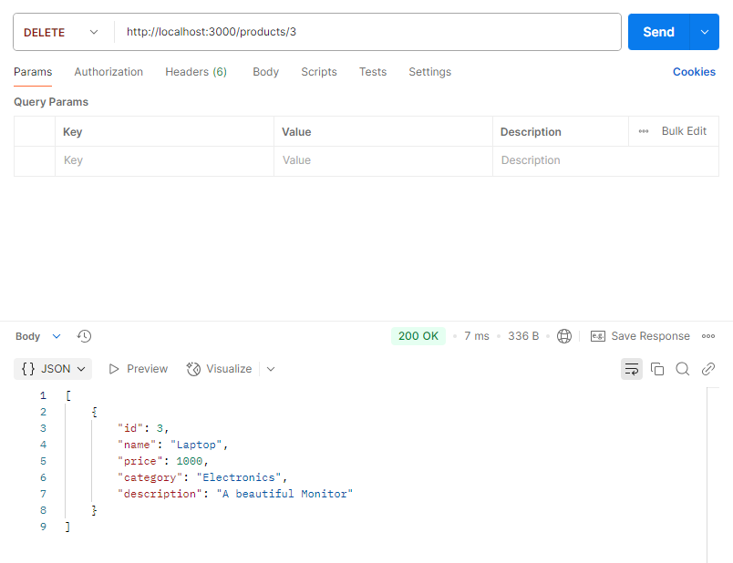

# Gestión de Productos API

## Instrucciones para ejecutar el proyecto

1. **Clonar el repositorio:**

   ```bash
   git clone <URL_DEL_REPOSITORIO>
   cd gestion-productos
   ```

2. **Instalar las dependencias:**

   Ejecuta el siguiente comando para instalar las dependencias necesarias:

   ```bash
   npm install
   ```

3. **Ejecutar el servidor:**

   - Para iniciar el servidor en modo producción, utiliza el siguiente comando:

     ```bash
     npm start
     ```

   - Para iniciar el servidor en modo desarrollo (con reinicio automático al detectar cambios), utiliza:

     ```bash
     npm run dev
     ```

4. **Probar la API:**

   La API estará disponible en `http://localhost:3000`. Puedes utilizar herramientas como Postman o `curl` para interactuar con las rutas de la API.

## Rutas de la API

- `GET /`: Muestra un mensaje de bienvenida.
- `GET /products`: Devuelve la lista de todos los productos.
- `GET /products/:id`: Devuelve un producto específico por su ID.
- `POST /products`: Agrega un nuevo producto.
- `PUT /products/:id`: Actualiza un producto existente por su ID.
- `DELETE /products/:id`: Elimina un producto por su ID.

## Pruebas de la API

Se realizaron pruebas a cada una de las rutas de la API utilizando Postman. A continuación se describen las pruebas realizadas y se incluyen capturas de pantalla de los resultados.

### Prueba de `GET /`

- **Descripción**: Se probó la ruta raíz para verificar que el servidor está funcionando y muestra un mensaje de bienvenida.
- **Resultado**: La respuesta fue exitosa y se mostró el mensaje "Bienvenido a la API REST de Gestión de Productos".
- **Captura de pantalla**:

  

### Prueba de `GET /products`

- **Descripción**: Se probó la ruta para obtener la lista completa de productos.
- **Resultado**: La respuesta fue exitosa y se devolvió un array con todos los productos.
- **Captura de pantalla**:

  

### Prueba de `GET /products/:id`

- **Descripción**: Se probó la ruta para obtener un producto específico por su ID.
- **Resultado**: La respuesta fue exitosa y se devolvió el producto correspondiente al ID proporcionado.
- **Captura de pantalla**:

  

### Prueba de `POST /products`

- **Descripción**: Se probó la ruta para agregar un nuevo producto.
- **Resultado**: El producto fue agregado exitosamente y se devolvió el objeto del nuevo producto.
- **Captura de pantalla**:

  

### Prueba de `PUT /products/:id`

- **Descripción**: Se probó la ruta para actualizar un producto existente.
- **Resultado**: El producto fue actualizado exitosamente y se devolvió el objeto del producto actualizado.
- **Captura de pantalla**:

  

### Prueba de `DELETE /products/:id`

- **Descripción**: Se probó la ruta para eliminar un producto por su ID.
- **Resultado**: El producto fue eliminado exitosamente y se devolvió el objeto del producto eliminado.
- **Captura de pantalla**:

  

