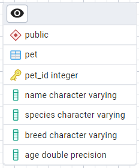

# Tarea 1 - William Saldarriaga

## Punto 1: Modelo ER Básico - Pet Store (sin relaciones)

Este modelo entidad-relación contiene la información de una unica tabla que almacena la información sobre las mascotas en una tienda de mascotas. 

### Entidades

#### Pet (Mascota)
Representa a las mascotas en la tienda. Los atributos que describen sus características básicas.

- **Pet_ID**: Clave primaria, identificador único para cada mascota.
- **Name**: Nombre de la mascota.
- **Species**: Especie de la mascota (por ej: perro, gato, ave, etc.).
- **Breed**: Raza de la mascota.
- **Age**: Edad de la mascota.

### Relaciones

no hay relaciones ya que es una unica tabla.

### Diagrama

---

## Punto 2: Modelo ER Básico - Library

Se relaciona el modelo entidad-relación básico para una biblioteca. El modelo está diseñado para gestionar información sobre libros y autores.

### Entidades

#### Book (Libro)
La entidad `Book` representa los libros disponibles en la biblioteca.

- **Book_ID**: Identificador único para cada libro. Esta es la clave primaria de cada libro.
- **Title**: Título del libro.
- **Genre**: Género literario del libro.
- **Publication_Date**: Fecha de publicación del libro.

#### Author (Autor)
La entidad `Author` representa los autores de los libros.

- **Author_ID**: Identificador para cada autor. Esta es la clave primaria de cada autor.
- **Name**: Nombre del autor.
- **Nationality**: Nacionalidad del autor.

### Relaciones

- Un autor puede escribir uno o más libros, y cada libro tiene un único autor (1:M).

### Diagrama

---

## Punto 3: Modelo ER Complejo - Hotel Reservation System

Se relaciona el modelo entidad-relación para un sistema de reservas de hotel. El modelo con tiene Entidades para gestionar información sobre clientes, habitaciones y reservas.

### Entidades

#### Customer (Cliente)
La entidad `Customer` representa a los clientes del hotel. 

- **Customer_ID**: Identificador único para cada cliente. Clave primaria
- **Name**: Nombre completo del cliente.
- **Email**: Dirección de correo electrónico del cliente.
- **Phone**: Número de teléfono del cliente.

#### Room (Habitación)
La entidad `Room` describe las habitaciones disponibles en el hotel. 

- **Room_ID**: Identificador único para cada habitación. Clave primaria
- **Number**: Número de la habitación.
- **Type**: Tipo de habitación
- **Price**: Precio por noche de la habitación.

#### Reservation (Reservación)
La entidad `Reservation` gestiona las reservas realizadas por los clientes. 

- **Reservation_ID**: Identificador único para cada reservación, Clave primaria.
- **Start_Date**: Fecha de inicio de la reservación.
- **End_Date**: Fecha de fin de la reservación.
- **Customer_ID**: Clave foránea que referencia a `Customer`.
- **Room_ID**: Clave foránea que referencia a `Room`.

### Relaciones

- Un cliente puede tener una o más reservas, pero una reserva pertenece a un único cliente (1:M).

- Una habitación puede ser reservada múltiples veces, pero cada reserva está asociada a una única habitación (1:M).

### Diagrama

