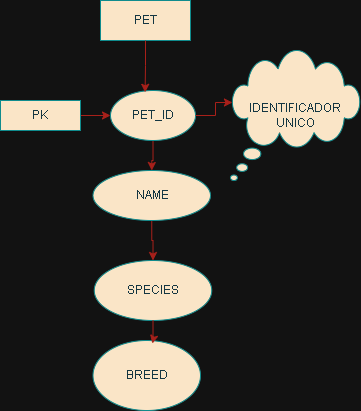
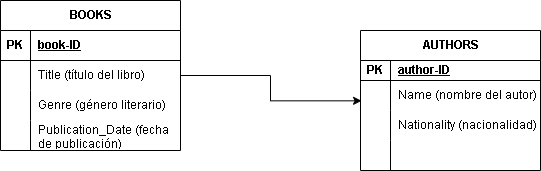
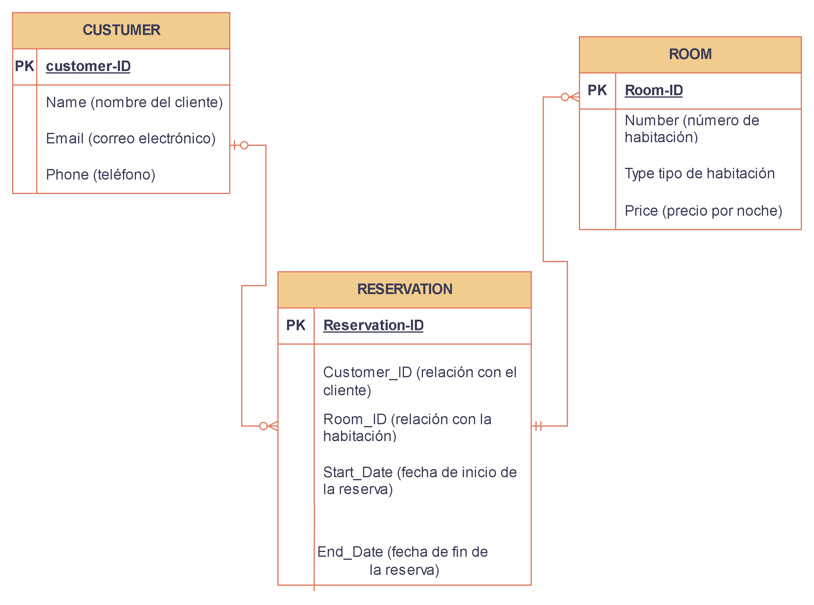

# Modelo ER Básico

Pet Store

sin relaciones
Entidades:

Este modelo representa una tienda de mascotas que gestiona información básica sobre las mascotas disponibles. La entidad Pet contiene atributos que permiten identificar y describir a cada mascota.

## 2  Modelo ER Básico - Library

Relación:

 Un autor puede escribir uno o más libros, y cada libro tiene un único autor.
Cardinalidad: 1:N (un autor puede escribir muchos libros).
Descripción:
El modelo representa una biblioteca donde se gestiona información de libros y sus autores. La relación Writes conecta a la entidad Author con la entidad Book, estableciendo que un autor puede tener varios libros asociados.

## 3 Modelo ER Complejo - Hotel Reservation System

Relaciones:

Makes: Un cliente puede hacer una o más reservas, pero cada reserva pertenece a un único cliente.
Cardinalidad: 1:N (un cliente puede hacer muchas reservas).
Includes: Una habitación puede ser reservada múltiples veces, pero cada reserva está asociada a una única habitación.
Cardinalidad: 1:N (una habitación puede estar asociada a muchas reservas).

Este modelo representa un sistema de reservas de hotel. La entidad Customer contiene información de los clientes, Room describe las habitaciones disponibles, y Reservation gestiona la información de las reservas. Las relaciones aseguran que cada reserva esté vinculada a un cliente y a una habitación.
