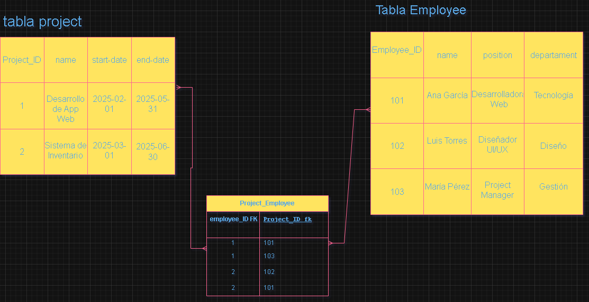

# Modelos ER con Relaciones Muchos a Muchos

## punto 1

tabla Course_Student tiene como función principal conectar las tablas Course y Student. Para lograr esta relación, necesita "importar" los identificadores únicos (Course_ID y Student_ID) de las tablas principales.

Entonces:

Course_ID se convierte en FK porque hace referencia a la PK de la tabla Course.
Student_ID se convierte en FK porque hace referencia a la PK de la tabla Student.
Esto permite que la tabla Course_Student mantenga la integridad referencial, es decir:

Si un curso o estudiante es eliminado, se puede controlar su impacto en la relación.
Cuando un estudiante se inscribe en un curso:
Se registra una entrada en la tabla Course_Student.
Por ejemplo, si el estudiante "Ana" con Student_ID = 101 se inscribe en el curso "SQL Basics" con Course_ID = 1, la tabla Course_Student tendrá una fila así:

Course_ID | Student_ID

1         | 101

Esto permite que la base de datos mantenga el registro de múltiples inscripciones de cada estudiante en diferentes cursos.

## PUNTO 2

Proyecto "Desarrollo de App Web" (Project_ID = 1)

Ana García (Employee_ID = 101) y María Pérez (Employee_ID = 103) están asignadas a este proyecto.
Proyecto "Sistema de Inventario" (Project_ID = 2)
Ana García (Employee_ID = 101) y Luis Torres (Employee_ID = 102) trabajan en este proyecto