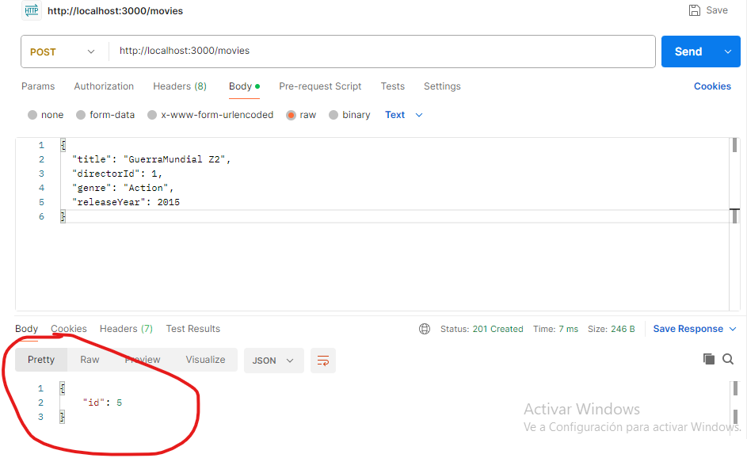

#### prueba de api utilziando  Postman                                                                       # utilizando el metodo GET
                                                                        
### Utiliznado el metodo POST
en est epunto requiero ayuda no se por que solo me devuelve los datos del id

# utilizando el metodo PUT
con este metodo me genero este error 

### Utiliznado el metodo delete funciono corectamente 

